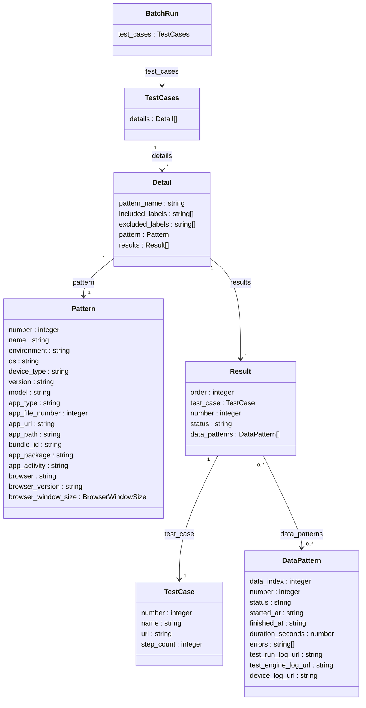

この記事は、[MagicPod Advent Calendar 2025](https://adventar.org/calendars/11578) 7日目の記事です。

## はじめに

[MagicPod](https://magicpod.com/) はノーコードのテスト自動化ツールです。
モバイルアプリ・Webアプリどちらのテストにも対応しています。

この記事の読者の方は、おそらくMagicPodを使っている方だと思うので、細かい説明は省きます。

早速ですが、皆さんは定期的なトリガ、もしくは、自動化されたトリガで作成したテストを実行していますよね？

もちろん、実行するだけではなく信頼できるテスト結果を得るためには、作成したテストの中に脆いテスト[^1]や信頼不能テスト[^2]が含まれている場合は改善をしていく必要があります。
しかしながら、MagicPodが対象としているUIを操作してシステムを操作する自動テストにおいては、ネットワーク・インフラ・データベースの状態など、さまざまな因子が影響して失敗することがあります。

特に、信頼不能テスト(テストコードやプロダクトコードに全く変更を加えていないのに失敗するテスト)については、やむを得なく再実行で対応するケースがあります。
そこで本記事では、失敗したテストケースだけを指定して再実行する方法を紹介します。
なお、記事内では考え方や、取得できるデータ構造を交えてご紹介しますが、具体的な実装については示しません。
リクエストを行う際の細かなTIPSも書いているので、そちらも参考にしながら実装してみていただけると良いと思います。

## 再実行の手段

再実行の手段としては、次のようなものがあります。

1. テスト一括実行でフォルダやラベル、テストケース番号を指定して実行する[^3]
2. MagicPod Web APIの呼び出しを行う
3. MagicPod MCPサーバ(ベータ版)を用いる

この記事では、 2. の MagicPod Web API を用いて実行する方法について紹介します。

## 再実行の流れ

理想はポチッと押すだけで、失敗したテストケースを特定し、再実行してくれることです。
それを実現するための流れは次の通りです。

1. 対象のテスト一括実行番号を特定する
2. 特定した一括実行の結果を取得し、失敗したテストケース番号を識別する
3. 失敗したテストケース番号を指定して実行する

## 対象のテスト一括実行番号を特定する

MagicPod Web API[^4]より、次のエンドポイントを利用します。
実行にはAPIキーが必要なので、MagicPodにログインして、APIキーを取得しておきましょう。[^5]

**BatchRun**
```
[GET]
/v1.0/{organization_name}/{project_name}/batch-runs/
```

- organization_name: あなたの組織名
- project_name: あなたのプロジェクト名

組織名とプロジェクト名の確認方法は、[こちらの記事](https://support.magic-pod.com/hc/ja/articles/6763993389081-%E3%82%B9%E3%82%BF%E3%83%BC%E3%83%88%E3%82%AC%E3%82%A4%E3%83%89-2-%E3%83%86%E3%82%B9%E3%83%88%E3%81%AE%E4%BD%9C%E3%82%8A%E6%96%B9-%E5%89%8D%E5%8D%8A-%E3%83%96%E3%83%A9%E3%82%A6%E3%82%B6)の1−1.作成を確認してください。


このAPIを呼び出すと、次のような結果が得られます。

::: details batch-runsの取得結果(一部省略済み)

```json
{
  "organization_name": "Your-Organization-Name",
  "project_name": "Your-Project-Name",
  "batch_runs": [
    {
      "batch_run_number": 50,
      "test_setting_name": "日次実行",
      "branch_name": "main",
      "status": "failed",
      "status_number": 2,
      "started_at": "2025-12-05T11:26:58Z",
      "finished_at": "2025-12-05T13:14:34Z",
      "duration_seconds": 6456.320871,
      "test_cases": {
        "succeeded": 60,
        "failed": 6,
        "total": 67,
        "unresolved": 1
      },
      "url": "https://app.magicpod.com/Your-Organization-Name/Your-Project-Name/batch-run/1/",
      "executed_via": "scheduled_run",
      "executed_by": null
    }
    ...
  ]
}
```

:::

実際には複数の一括実行結果が取得されるので、再実行対象の一括実行結果を特定する必要があります。
今回は、直近のテスト一括実行結果に対して再実行したいので、 `test_setting_name` (MagicPodのテスト一括実行の画面における一括実行設定の設定名)をキーにして検索し、最も最新の結果である `batch_run_number` (MagicPodのテスト一括実行の画面における#)を取得します。

上記のjsonの場合、"test_setting_name": `日次実行` という値をキーとして、 "batch_run_number": `50` という値を取得します。

## 特定した一括実行の結果を取得し、失敗したテストケース番号を識別する

batch-runsでも成功数や失敗数などは取得できますが、実際にどのケースで失敗したのかがわかりません。
そこで、次のエンドポイントから情報を取得します。

- batch_run_number: 先ほど取得した`batch_run_number` を指定

**BatchRun**
```
[GET]
/v1.0/{organization_name}/{project_name}/batch-run/{batch_run_number}/
```

::: details batch-runの取得結果(一部省略済み)

```json
{
  "organization_name": "Your-Organization-Name",
  "project_name": "Your-Project-Name",
  "batch_run_number": 50,
  "test_setting_name": "日次実行",
  "branch_name": "main",
  "status": "failed",
  "status_number": 2,
  "started_at": "2025-12-05T11:26:58Z",
  "finished_at": "2025-12-05T13:14:34Z",
  "duration_seconds": 6456.320871,
  "test_cases": {
    "succeeded": 60,
    "failed": 6,
    "total": 67,
    "unresolved": 1,
    "details": [
      {
        "pattern_name": "実行設定1",
        "included_labels": [
          "HappyPath"
        ],
        "excluded_labels": [
          "WIP"
        ],
        "pattern": {
          "number": 1,
          "name": "実行設定1",
          // ここには実行環境に関する情報が入ります
        },
        "results": [
          {
            "order": 1,
            "test_case": {
              "number": 22,
              "name": "Testcase1",
              "url": "https://app.magicpod.com/Your-Organization-Name/Your-Project-Name/20/",
              "step_count": 46
            },
            "number": 22,
            "status": "succeeded",
            "started_at": "2025-12-05T11:27:10Z",
            "finished_at": "2025-12-05T11:28:37Z",
            "duration_seconds": 86.81223,
            "data_patterns": null,
            "note": null,
            "errors": [],
            "test_run_log_url": "https://app.magicpod.com/api/v1.0/Your-Organization-Name/Your-Project-Name/batch-run/3386/1/1/1/test-run-log/",
            "test_engine_log_url": "https://app.magicpod.com/api/v1.0/Your-Organization-Name/Your-Project-Name/batch-run/3386/1/1/1/test-engine-log/",
            "device_log_url": null
          },
          {
            "order": 2,
            "test_case": {
              "number": 88,
              "name": "Testcase2",
              "url": "https://app.magicpod.com/Your-Organization-Name/Your-Project-Name/88/",
              "step_count": 27
            },
            "number": 88,
            "status": "failed",
            "started_at": "2025-12-05T11:45:55Z",
            "finished_at": "2025-12-05T11:47:36Z",
            "duration_seconds": 100.460071,
            "data_patterns": null,
            "note": null,
            "errors": [],
            "test_run_log_url": "https://app.magicpod.com/api/v1.0/Your-Organization-Name/Your-Project-Name/batch-run/3386/1/9/1/test-run-log/",
            "test_engine_log_url": "https://app.magicpod.com/api/v1.0/Your-Organization-Name/Your-Project-Name/batch-run/3386/1/9/1/test-engine-log/",
            "device_log_url": null
          }
        ]
      }
    ]
  },
  "url": "https://app.magicpod.com/Your-Organization-Name/Your-Project-Name/batch-run/50/"
}
```

:::

jsonだとわかりにくいので、一部簡略化したモデルを示します。



この結果をもとに失敗しているテストケース番号を抽出していくのですが、1つ注意点があります。
一括実行設定で、[複数の実行設定](https://support.magic-pod.com/hc/ja/articles/25513145595801-%E4%B8%80%E6%8B%AC%E3%83%86%E3%82%B9%E3%83%88%E5%AE%9F%E8%A1%8C#multiple_types)を設定することができますが、この設定内容によって抽出方法が変わってきます。

この実行設定の使い方としては、次のようなパターンが考えられると思います。

1. 一つの一括実行設定の中に、複数の異なる端末設定の実行設定が混在している<br>　→　同じテストスイート(テストケース群)を異なる端末・OSバージョンで実行したい
2. 一つの一括実行設定の中に、同じ端末設定の実行設定が複数存在しており、それぞれの実行設定で実行指定しているテストケースが異なる<br>　→ フィードバックスピード向上のために、テストスイートを分割して、並列実行したい

もし、1.のパターンで実行している場合は、次のように失敗したテストケース番号を抽出していきます。

1. `details` にある `pattern` を順番に見ていく
2. `pattern` の中の `results` をみていき、`status` が `failed`(失敗) のもの、あるいは、 `failed`と`unresolved`(要確認) の `number` を抽出する
3. `pattern` ごとに失敗したテストケース番号をカンマ区切りで連結する

:::message
infomation
このケースでは、`pattern` は、それぞれの実行環境を表しているため、`pattern` ごとに失敗したテストケース番号を抽出しないと、同じ環境で再テストが実施できなくなります。

:::

もし、2.のパターンで実行している場合は、 次のように失敗したテストケース番号を抽出していきます。

1. `details` にある `pattern` を順番に見ていく
2. `pattern` の中の `results` をみていき、`status` が `failed`(失敗) のもの、あるいは、 `failed`と`unresolved`(要確認) の `number` を抽出する
3. 抽出したテストケース番号をカンマ区切りで連結する (patternごとに分ける必要はない)

:::message
infomation
このケースでは、`pattern` は、実行環境ではなく、単にテストスイートを分割するためのものとなっているため、`pattern` ごとに分ける必要はなく、まとめてしまって問題ありません。
再実行時にも並列実行したい場合は、1.で紹介したように `pattern` ごとに分けることができますが、
並列実行による実行タイミングの重なりによりテストが失敗するケースがあったり、
実行するためのパラメータを細かく指定してあげなければならないため、再実行時は並列ではなく1台で実行することをおすすめします。
:::

## 失敗したテストケース番号を指定して実行する

次のエンドポイントで抽出したテストケース番号を指定して、再実行をしていきます。

**BatchRun**
```
[POST]
/v1.0/{organization_name}/{project_name}/batch-run/{batch_run_number}/
```

### 「1. 一つの一括実行設定の中に、複数の異なる端末設定の実行設定が混在している」パターンで実行している場合

あらかじめ、ステップを何も追加していない空のテストケースを用意しておきましょう。

:::message
infomation
例えば、実行設定1(iOS 18)では成功していたが、実行設定2(iOS 17)では失敗していた、という場合に、
実行対象のテストケース番号をブランクで指定してしまうとAPIエラーとなってしまうため、空のテストケースを実行させてAPIのエラーを回避します。
:::

そして、APIを呼び出して再実行をしますが、複数の実行設定(`pattern`)を持つ一括実行を1回のみで完結させるためには、
一括実行設定番号(`test_settings_number`)を指定しての実行ができません。[^6]

そのため、一括実行で指定している各パラメータをすべてpayloadに含めてあげる必要があります。
payloadを指定する際、既存の一括実行設定に含まれるパラメータをMagicPod上から確認するのが便利です。[^7]

「curlで実行 (Mac/Linux ターミナル) (詳細設定)」から詳細なpayloadを確認することができます。
`pattern` ごとに取得した失敗したテストケース番号(複数ある場合はカンマ区切り)を `pattern_name` と突き合わせて、該当のパターンの設定に以下のように失敗したテストケース番号を指定していきます。
もし、該当の `pattern` に失敗したテストケースが存在しなかった場合は、あらかじめ準備しておいた空のテストケース番号を指定しましょう。

なお、設定内容は組織やチームによって異なるため、一部分のみを記載します。

```json
"shared_variables": [
],
"test_case_numbers": "1,3,10,17",
```

:::message
infomation
定期的に実行している一括実行設定が変化した場合は、再実行用のpayloadも更新する必要があるため注意してください。
特にモバイルテストの場合、使用するアプリバージョンが頻繁に変更となるケースが多いので、一括実行結果を取得した際、自動的に最新の値が参照されるような仕組みを入れておくと良いでしょう。
:::

その後、APIを呼び出して再実行を行います。

### 「2. 一つの一括実行設定の中に、同じ端末設定の実行設定が複数存在しており、それぞれの実行設定で実行指定しているテストケースが異なる」パターンで実行している場合

あらかじめ、普段実行している一括実行設定を複製して、再実行用の一括実行設定を作成しておきましょう。

:::message
infomation
再実行用の一括実行を設定する目的としては、再実行の一括実行を識別できるようにするためです。
再実行で再び失敗した場合に、再実行用の一括実行設定を特定して、さらに再実行することができるようになります。

定期的に実行している一括実行設定が変化した場合は、再実行用の一括実行設定も更新する必要があるため注意してください。
:::

こちらのケースでは、再実行用の一括実行設定の番号と、失敗したテストケース番号だけを指定してあげれば良いので、シンプルなpayloadで実行できます。

```json
test_settings_number: 51,
"test_settings": [
    test_case_numbers: "1,3,10,17",
]
```
その後、APIを呼び出して再実行を行います。

## おわりに
もっとライトな記事にするつもりでしたが、気づいたら1万文字オーバー(jsonを含む)になってしまいました。
本来は、実装例なども示せると良いと思うので、余裕ができたら追記します。

参考になった、よくわからなかった、こんなやり方もあるよなど、コメントをお待ちしております。

[^1]: [サバンナ便り ～ソフトウェア開発の荒野を生き抜く～ 第8回](https://gihyo.jp/dev/serial/01/savanna-letter/0008)
[^2]: [サバンナ便り ～ソフトウェア開発の荒野を生き抜く～ 第2回](https://gihyo.jp/dev/serial/01/savanna-letter/0002)
[^3]: [MagicPod ヘルプセンター 特定のテストケースのみを一括実行したい](https://support.magic-pod.com/hc/ja/articles/6760000467481-%E7%89%B9%E5%AE%9A%E3%81%AE%E3%83%86%E3%82%B9%E3%83%88%E3%82%B1%E3%83%BC%E3%82%B9%E3%81%AE%E3%81%BF%E3%82%92%E4%B8%80%E6%8B%AC%E5%AE%9F%E8%A1%8C%E3%81%97%E3%81%9F%E3%81%84)
[^4]: https://app.magicpod.com/api/v1.0/doc/
[^5]: [MagicPod ヘルプセンター MagicPodが提供するWeb APIの使用方法](https://support.magic-pod.com/hc/ja/articles/28160772587417-MagicPod%E3%81%8C%E6%8F%90%E4%BE%9B%E3%81%99%E3%82%8BWeb-API%E3%81%AE%E4%BD%BF%E7%94%A8%E6%96%B9%E6%B3%95#01K6C1J18R6PFZMFQ1VC2NAJSZ)
[^6]: ただし、実行設定ごとに分ける場合は、一括実行設定番号を指定しての実行が可能です。
[^7]: [MagicPod ヘルプセンター コマンドライン一括テスト実行（クラウド環境）](https://support.magic-pod.com/hc/ja/articles/4408903744409-%E3%82%B3%E3%83%9E%E3%83%B3%E3%83%89%E3%83%A9%E3%82%A4%E3%83%B3%E4%B8%80%E6%8B%AC%E3%83%86%E3%82%B9%E3%83%88%E5%AE%9F%E8%A1%8C-%E3%82%AF%E3%83%A9%E3%82%A6%E3%83%89%E7%92%B0%E5%A2%83)